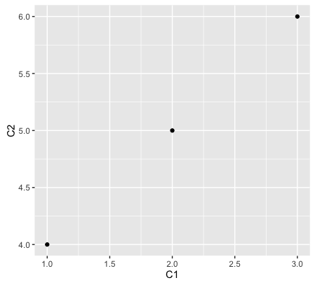

# Data: 
Data in R stored in a object, an object can contain one or more elements. The nature of each element is what we called **variable type**. The structural feature of an object dictate how the elements are arranged, and we call this structural feature **object type**. 

### [Declare a Variable](https://github.com/weitingwlin/r-primers/blob/master/Documents/Working_with_Rstudio.md#variables)

Example:

		X <- 1
		
With this command you declare a variable X, and give X a value 1.

## Variable types (elements)
#### typeof
You can check the type of a variable or a value:

	typeof(1)   # "double"

### Number ("double")
A variable can be a number (called "double" for some reason). `X <- 1` would be an example.

	typeof(X)   # "double"

Note when you use the variable in function as argument, you use it without quotation mark. And the function `typeof` judges the type of the **value** of X (i.e. 1).

Otherwise:
	
	typeof("X") # "character"

### String, character
A variabel can be a string (or called "chracter"); you give a string within " " or ''.

	Y <- "Paria"
	typeof(Y)    # "character"

### Logical
Often you see logical variable as the result of [logical operations](logical_operation.md).
   
   	Z <- X == 1   # TRUE
   	typeof(Z)     # "logical"
   	
A logical variable have value **TRUE** or **FALSE**, **T** or **F**.

(Note: **TRUE/FALSE** and **T/F** are interchangeable.)  	
### Others: 
#### Factors
  	A <- factor(c("big", "big","small","big"))
    	print(A)
    	table(A)
    	unclass(A)
  	B <- factor(c("big", "big","small","big"),
  				  levels = c("small","mediem","big"))
    	print(B)
    	table(B)
    	unclass(B)

#### Date/Time 
  	x <- as.Date("1986-02-21")
  	y <- as.Date("1970-01-02")
    	print(x)
    	print(y)
      	print(unclass(x))
      	print(unclass(y))
      	class(x)

   	weekdays(x)
   	months(x)
   	quarters(x)

  	z <- Sys.time()
   	zlt <- as.POSIXlt(z)
    names(unclass(zlt))
    
  	zlt$yday
  		help(strptime)
  	k <- strptime("December ",)
  
  
  
#### Missing values Na, NaN
There are two kinds of missing values: **NaN** for "Not a Number", **Na** for "Not available":
  
	  x <- c(1,3,NA, NaN,4)

 Check **Na** with function `is.na` (hint: NaN is a kind of Na)
   
    is.na(x)
    
 Check **NaN** with function `is.nan` (hint: Na is not NaN)
    
    is.nan(x)

## Object types (structure)

### Vectors , c(...)
We can combine the same type of variable into a vector, using the function `c`.

 	y <- c(T,F,F,T)
   	z <- 1:6

More example of makeing sequence can be found in [script\_ex\_sequence.R](https://github.com/weitingwlin/r-primers/blob/master/R_files/script_ex_sequence.R)

You can check whether an object is a vector:

	is.vector(y)
	
For a vector, you can check its length:
	
	length(z)

##### indexing in vector
You can reach variables in a vector using indices, in `[]`.
		
	z[2]
	z[3:5]
	y[c(1,3)]

### Matrix
Create a matrix using function `matrix`:

  	M <- matrix(1:6, ncol=2, nrow =3)
  	is.matrix(M)   # TRUE

Check the dimensions of M

 	dim(M)
  	aM <- attributes(M) # this is a list
  	
Add column names, row names:
	
	 colnames(M) <- c('C1', 'C2')
	 rownames(M) <- c('A', 'B','C')
	 
Check `M` again (or `attributes(M)`).
	 
##### Indexing in a matrix
You can extract, find, see a elemment or more in a matrix using index, with `[]`.

**1 D index**: each element in a matrix has a 1 dimensional ID. Check how it works.

	M[2] # 2
	M[1:6] # 1 2 3 4 5 6
	       # transfer matrix into vector
	
**2 D index**: you can also find an element by `[row, column]`, or `[row, ]` for a row, `[, column]` for a column. 

	M[3,2] # 3rd row, 2nd column
	M[3, ] # 3rd row
   	M[ ,2] # 2nd column
   	
**Row names, column names**: 
	
	M['A','C2']
	M[,'C2']
	M['A',]

### Dataframe
Dataframe can be viewed as an advanced form of matrix. It can take different [variable type]() as columns. 

You can make a dataframe from a matrix:

	Mdata <- data.frame(M)	 

Or make a dataframe from several vectors:
	
	  x <- data.frame(foo = 1:4, 
	                  bar = c("A","B","C","D"), 
	                  thr= c(T,T,F,T)) 
	                  
#### Indexing data frame
You can do all the **indexing** with data frame as you do with matrix, **plus** using `$` to index a column.
		
		x[1,2]
		x[2,]
		x[2,'bar']
		x$foo  # use $ 
		
#### Explorring data frames: 
Sometimes a data frame can be quite big, and you might want check some basic information without printing the whole thing out on the screen.

(Actually, with something as small as our mock data frame, you can, try `print(x)`)

To demonstrate working with larger data set, we will use the `mpg` data from the [**ggplot2**]((https://cran.r-project.org/web/packages/ggplot2/index.html)) package ([install the package](https://github.com/weitingwlin/r-primers/blob/master/Documents/Packages.md#download-and-install-packages) if you haven't).

	library(ggplot2)	

For more information about this data set , type `? mpg` and check the [help window](Working_with_Rstudio.md). See the dimension of a data frame:

      	dim(mpg)  # nrow, ncol
  		nrow(mpg) # check number of rows
  		ncol(mpg)	

Function `str` provide better summary of the data structure:

		str(mpg)  

Function `summary` provide a  simple statistical summary.

      summary(x)
      summary(mpg)

To see the variable names, first few rows, last few rows:

 		names(mpg)
 		head(mpg)
 		tail(mpg)

#### Working with data frames

Dataframe holds information that in a form that many plotting and analysis function (and packages) recognize.  
	
	qplot(C1, C2, data = Mdata)
	

	
In this example, the function `qplot` from [package](Packages.md) **ggplot2** makes [biplot](Plot_biplots.md) of variable C1 to C2 from dataframe Mdata (and make X, Y label automatically). 

### List
List has even more flexibility:

	mylist <- list(myvector = 1:5, 
		            mymatrix = M, 
		            mydata = x)

#### Indexing with list

Check an item within list using `$`

	mylist$myvector

Multi-layer indexing
	
	mylist$mymatrix[2,]
	mylist$mydata$bar		  

#### Exploring

	summary(mylist)

