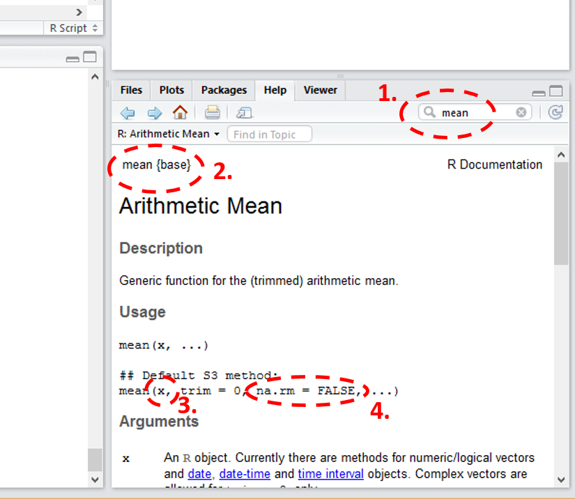

# Using a functions
Functions can be built-in in R, or from a [package](Packages.md), or we can write our own function.

## To call a function
To call a function you just type the function name with a `()`, the space between `()` is for **arguments** (the "input"). Even with functions that doesn't _require_ any arguments you cannot miss the `()`.

Example:

		getwd()

## Arguments (inputs)
More often we call a function with argument(s). 

Example:
	
	mean(c(1, 2,3))

### Default 
An argument can be **optional**, that means the function take a default value if the argument not given.

Example (calculating the same average but with NA, maybe a missing data):

	mean(c(1, 2,3, NA))
	
By _default_, the function `mean` will not remove NA, and you will get an NA. You can add an argument to tell the function to remove NA before calculating mean.

	mean(c(1, 2,3, NA), na.rm = TRUE)
## Return values (outputs)
If there is a return value, you can assign it to a (new or existeing) variable.

	mymean <- mean(c(1, 2,3))

## Learn how to use a function
How do I know there is an option in `mean` to removing NA? How do I know it's called `rm.na`?

This kind of information usually can be found in the help file.

Check the help file of `mean`:

	? mean

The document (or user manual) of function `mean` will appear on the help window.

1. you can also use this search bar
2. function `mean` is in the base package (installed with R)
3. On the **Usage** section you will see the syntax:
	**mean(x, trim = 0, na.rm = FALSE, ...)**
   ,where x is the required argument 
4. The optional arguments are the ones with default values (assigned with `=`), and you will find details in the **argument** section.

