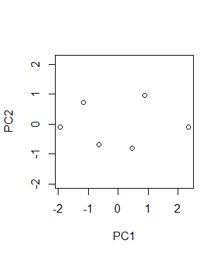

# PCA: pricipal component analysis

## Protocal
### 1. Prepare data as matrix or as dataframe
Each row should be an **observation**, each column be a **variable**.
##### Matrix
##### dataframe

### 2. Do PCA
##### Working with packages

### 3. Visualize results
##### biplot

## Primers
### [TBP_PCA1: examples in the _Wildi, 2013_ book](https://github.com/weitingwlin/r-primers/blob/master/Documents/TBP_PCA1.md)

1. Prepare hand-input matrix data
2. Do PCA with function `pca` in the _labdsv_ package
3. view simple biplot on PC ordination using base plotting function `plot`

  

### Elements in PCA

## References
Wildi, O. (2013). Data analysis in vegetation ecology. John Wiley & Sons.