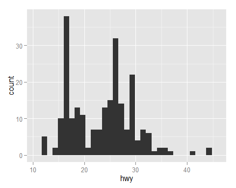

## Packages
Packages are a bundle/kit/toolbox of functions, data sets, ... that we can download together for our use. Most of the time we need one or more packages to complete our tasks.

### Download and install packages
Once you know the **name** of package you can download it using a command. For example,

        install.packages("ggplot2")		

With this command, R will download and install package _ggplot2_ for you.

Normally you only have to do this once. 

### Load packages
 
Every time you open Rstudio and before using functions in a package, you need to load it. 

		library(ggplot2)

Doing so, you tell R to search the name of functions/variables in the package ggplot2. So you can [call those functions](Functions_use.md).

For example, now when you run this line. R will find the function `qplot` and variable `mpg` from the _ggplot2_ package and [make the histogram](Plot_histograms.md) for you.

		qplot(hwy, data = mpg)

### Help, Manual, _CRAN_
Packages are stored in the [CRAN (The Comprehensive R Archive Network)](https://cran.r-project.org/index.html), and for each package there is an information page.(example again with the [_ggplot2_ package](https://cran.r-project.org/web/packages/ggplot2/index.html))

That is where you find the **Reference manual** .pdf for any packages.

(just **google** the packagename + R usually works, too)