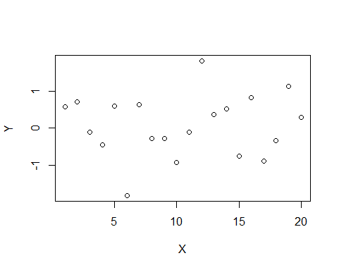
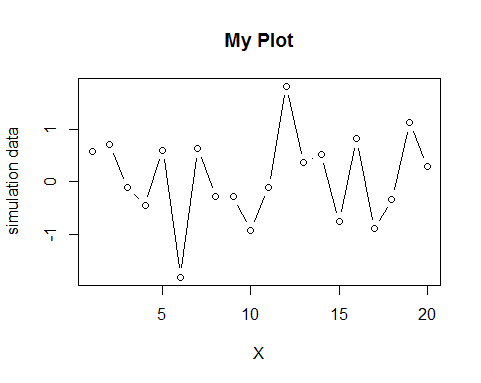
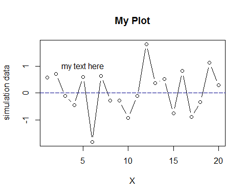
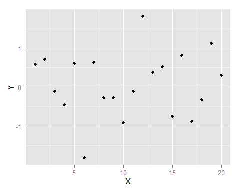
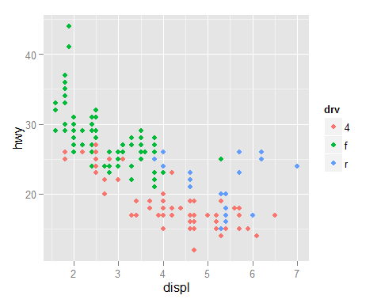
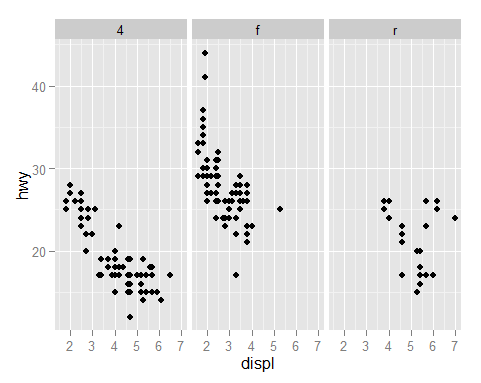
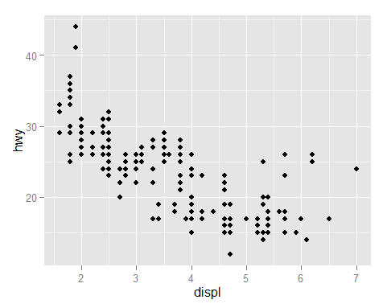
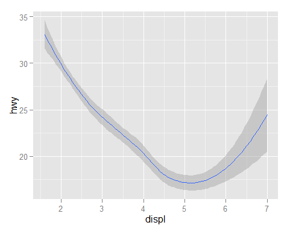
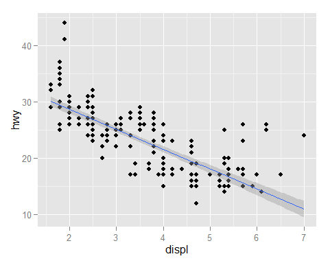

# Biplot, scatter plot, or X-Y plot

All scripts are also in **plot_biplot.R** ([GitHub link](https://github.com/weitingwlin/r-primers/blob/master/R_files/plots_biplot.R))

Making biplot using base plot system and _ggplot2_.

### 0. data
For this example we will use [simulated random numbers](Simulation_random.md).

    X <- 1:20
    set.seed(12345)  # so every time we get the same Y
    Y <-rnorm(20)

### 1. Using base plotting system :
With default settings:

    plot(X, Y)    

OR add some control:
    
    plot(X, Y, 
         type = "b", 
         main = "My Plot", 
         xlab = "X", 
         ylab ="simulation data")

What does `type = "b"` mean?

(Note you can always check the documentation by typing `? plot` in console for umformation about the [arguments and how to use](Function_use.md) the function `plot`.)

Add a line and some texts on the plot:

    abline(0,0, col="darkblue", lty=5)
    text(5, 1, 'my text here')

(Note that ` col="darkblue", lty=5` are **Graphical Parameters**, if you find the help file of `abline`, there is a link under **Argument--> ...**. For now, `col` is color, `lty` is line type )

## 2. using ggplot2 
Load the [package _ggplot2_](https://cran.r-project.org/web/packages/ggplot2/index.html) (please [install the package](https://github.com/weitingwlin/r-primers/blob/master/Documents/Packages.md#download-and-install-packages) if you haven't):

    #      install.packages("ggplot2")
    library(ggplot2)

Using the function `qplot` (quick plot)

    qplot(X,Y)

    
Note that `qplot` decided this would be a biplot, and make the plot using all [default arguments](Functions_use.md).    

(If there is only one input, qplot will make a [histogram](https://github.com/weitingwlin/r-primers/blob/master/Documents/Plot_histograms.md#3-using-ggplot2-qplot), try `qplot(Y)`)
 
## 3. working with dataset    
`mgp` is a built in data set of ggplot2 package. Use the function `str` to see what `mpg` looks like:

    	str(mpg) # see the strcture of this data frame

We can color-code our histogram with another variable  
  
    qplot(displ,	hwy,	data	=	mpg,	color	=	drv)	

Or plot each subsets in **facet** (or, subplots)   

    qplot(displ,	hwy,	data	=	mpg,	facets	=	.	~	drv)

## 4. Working with object: using ggplot
`ggplot` is another function in the ggplot2 package, gives us more control of the plot than `qplot`.     

We can first save the "plot" as an object (and use `summary` to see what it is):

    g <- ggplot(mpg, aes(displ,hwy ))
    summary(g)

Then plot it part by part (layer by layer); examples:

    print(g)# not plot yet!

Then add point:

    g + geom_point()

Then creat facets:

    g + geom_point() + facet_grid(. ~ drv)
    

    
## 5. Lines: smooth, lm
We can add a smooth line to the plot:

    g + geom_smooth()

Note that now we only plot the lines without the points.

We can change the line added to a "lm" (linear model; for detail of methods type `? stat_smooth`).
    
    g + geom_point() + geom_smooth(method = "lm")

Note that we plot points with the line now.

  
  
## 6. Style, design with ggplot    
We can change the color, size, transparency of the points.

     g + geom_point(color = "skyblue", size = 4, alpha = 3/4)

Note that we use a "name" to assign the color, check the list of colors by typing `colors()`. Argument `alpha` controls the transparency of color. 

  

    g + geom_point(aes(color = drv), size = 4, alpha = 1/2)

  