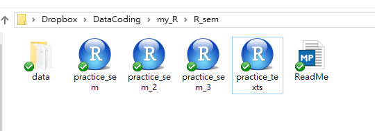
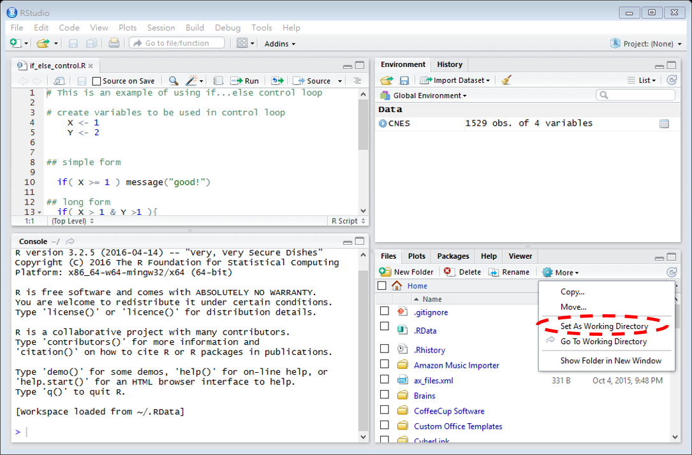

# Set up working environment

Give each project a folder (or "directory"), let's call it  **project folder**. In the folder, there should be a **ReadMe file** (e.g. ReadMe.md) that keeps a record for all the rest files and folders.

**Data** can be put in a seperate folder (maybe called "data").

When you are working on a project, set your **working directory to this folder**. The **R scripts** (.R files) will be kept in this project folder. 

* make each script small
* use [**relative path**](https://support.dtsearch.com/webhelp/dtsearch/relative_paths.htm) to get data 

## Working directory
 You can check and set current working directory at the **File** window (hint: click on **More** button). But a more convinient way is to use commands. 
 
#### getwd : check current working directory
To check current working directory (type the following in the console).

	getwd()

You can reach and [work with .R files](Working_with_scripts.md) that stored in your current working directoy. 

For example, you can [open a file](Working_with_scripts.md#open-a-r-file) with a line:

	file.edit("set_path.R")

#### setwd: set working directory
The function `setwd` set the working directory to assigned path.

For example: 
	
	setwd("C:/Users/Wei-Ting/Dropbox")

#### In R studio, you can also set working on the user interface: 
go to **Files** --> (click to the target folder) --> **More** --> **Set As Working Directory**

## Working with multiple machine
On different machines (either you are synching Dropbox, or flash drive ect.) the project folder might be on different **absolute path**s. So we need a script to set up machine-specific path.

#### set_path.R ([GitHub link](https://github.com/weitingwlin/r-primers/blob/master/R_files/set_path.R)) 
The file **set_path.R** is an example of this script.

(I would include one of this file in each project folder, and open this file and source it, every time I start working on a project.) 

In **set\_path.R** we use a [control loop](if_else_control.R) so R set the working directory to different path base on the information about the current computer.

### Note on GitHub + Dropbox

If you work on multiple machine and synchronizing the folders (for example on Dropbox) plus GitHub, **only push/pull from one machine**. 

(I don't know why but base on [ this discussion on stackoverflow](http://stackoverflow.com/questions/1960799/using-git-and-dropbox-together-effectively), it's safer this way.)