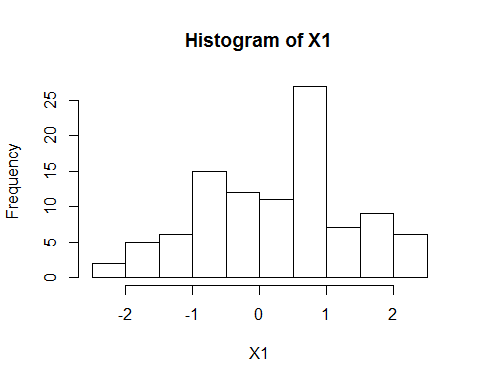
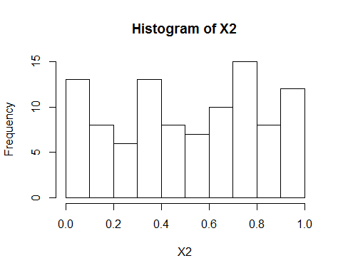
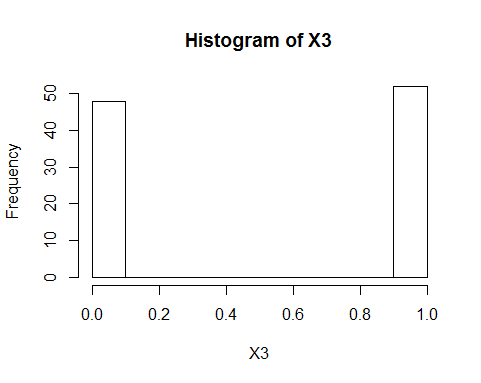

# Simulation: random numbers

We can make R produce some random numbers, according to a certain distribution.

Normal distribution with `rnorm` (We will talk about setting seed later):

        set.seed(12345) 
      X1 <- rnorm(100)
      hist(X1)

Uniform distriburion with `runif`:

        set.seed(12345) 
 	  X2 <- runif(100)
      hist(X2)

Binomial Distribution with `rbinom`:

       set.seed(12345)
      X3 <- rbinom(100,1, 0.5)
      hist(X3)

## Seed and reproducibility
     
The random numbers generated these ways are [not real random numbers](https://en.wikipedia.org/wiki/Pseudorandom_number_generator), they are from some kind of (long but finite, deterministic) list, and what we get from each simulation depends on the **seed**. 

Given the same seed, we will get the same "random number".

Try this many times (hint: results will be different):

  	  rnorm(5)

And try this many times (hint: results will be the same):

      set.seed(1)
      rnorm(5)    

When doing simulation in research, it is **recommended** to set seed (using `set.seed` function, to any number), so anyone (including you) can make exactly the same results. And improve the reproducibility of the research.

