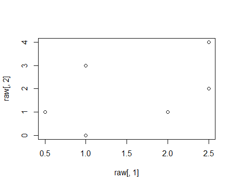

## TBP_PCA1: examples in the _Wildi, 2013_ book

This example is from p. 76~77 of the Wildi book.

All scripts are also in **TBP_PCA1.R**([GitHub link](https://github.com/weitingwlin/r-primers/blob/master/R_files/TBP_PCA1.R))

Note this is only one of many ways to do PCA

### 0. loading pacakges
In this example, Wildi used the `pca` function in the [_labdsv_](https://cran.r-project.org/web/packages/labdsv/index.html) package. Install the package if you have not ([un-comment](https://github.com/weitingwlin/r-primers/blob/master/Documents/Working_with_scripts.md#comments-un-comment) the following script).

	#  install.packages("labdsv")  

You only have to do this once. Everytime after just load th e package using `library` function.

	library('labdsv') # for the pca functions

[Learn more about packages](https://github.com/weitingwlin/r-primers/blob/master/Documents/Packages.md)

### 1. Prepare hand-input matrix data
Creat a 6x2 atrix named "raw" and assign the column names and row names
	
  	raw <- matrix(c(1,2,2.5, 2.5, 1,0.5, 0, 1, 2, 4, 3, 1), nrow = 6)
  	colnames(raw) <- c("s1","s2")
  	rownames(raw) <- c("r1","r2","r3","r4","r5","r6")

Use `str(raw)` or simply `raw` to see the matrix, or:

	  plot(raw[,1], raw[,2])

### 2. Do PCA with function `pca` in the _labdsv_ package
Calling the `pca` function, and save results as an object:

  	o.pca <-pca(raw)

view this object:

    o.pca

### 3. View simple biplot on PC ordination using base plotting function `plot`

   	plot(o.pca$scores[,1], o.pca$scores[,2], 
         type="p", 
         asp=1, 
         xlab = 'PC1', 
         ylab = 'PC2')

### 4.  Percentage of variance explained by each PC

	  E <- o.pca$sdec^2/o.pca$totdev

PC1 explained 82.4% of variance,...