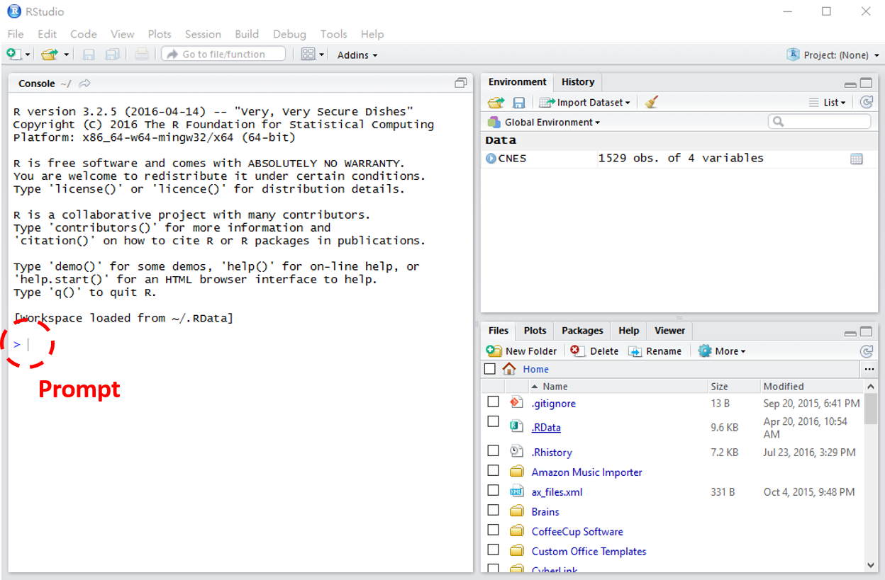
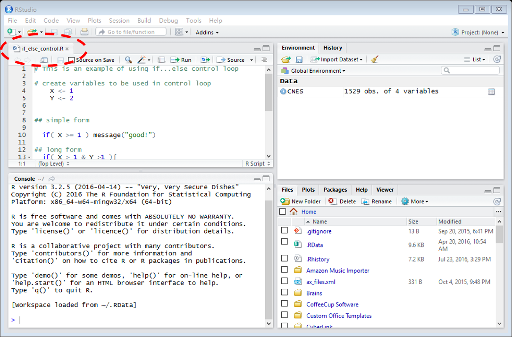

# Rstudio
Rstudio is an integrated development environment for R. With Rstudio you can navigate through R more easily.

### Open it!

## Console 
### prompt `>`, command
In the console window, there is a `>`, called **prompt**, you can type something after the prompt (or copy-paste), the text you typed is called **command**:

For example, type after the prompt :
 
	1 + 1

This is an example of [**Arithmetic operation** (calculations)](arithmetic_operation.md).
In the console you can also do [**Logical operation**](logical_operation.md):

	1 > 0

### Calling functions
At the console, you can also call a function:

   	ls()

Here, `ls` is a function that **returns** the list of things in your **environment** (see the later section). Or,

	sqrt(4) # calcualate square root of 4

[More about using functions](Functions_use.md). 

### Working with variables 
Another thing you can do is declare or assign value to a variable. 

##### Declare a variable
("Declare" means "create, specify, define, name" a variable...)

In R, you usually declare a variable, and give it a **value** at the same time, using `<-` ("smaller than" and "minus"):

	X <- 1

With this **command** you declare a variable `X`, and give `X` a value 1.

Type the vairable name to see the values.

	X

You can save whatever is returned (the result) in a new or existing variable.

	X <- 1+1

Note that with the above command you change (update) the value of `X`. Type `X` to check the new value of variable `X`.

##### Logical and Arithmetic operations
Variables can be used in [logical operations](logical_operation.md):

	X > 1  # return: TRUE

Or in [Arithmetic operations](arithmetic_operation.md):
   
    Y <- X*3 
    Y   # see what is the value of Y 

### Previous command
Use **up** and **down** keys to toggle through your previous commands. 

## Environment (workspace)
Now, R memorized your variable X and its value. X will appear on the **environment** window. You can also use function `ls()` to see what is in your environment. 

## Scripts (.R files)
Besides typing your commands, you can also copy-paste the commands... 

**Scripts** refer to the command texts, usually saved in .R files.

You can create a new .R file by clicking the icon, or [open one existing .R file](https://github.com/weitingwlin/r-primers/blob/master/Documents/Working_with_scripts.md#open-a-r-file). (Don't know where to start? [Downlowd this file](https://github.com/weitingwlin/r-primers/blob/master/R_files/script_ex_sequence.R) and open in R studio.) 

By default, with an open scripts the console will be pushed down:

### Learn more about [working with scripts and .R files](Working_with_scripts.md)

## Everthing else (help, figure, package...)
**Files** looks like a folder system. This is where you can find files and [set working environment](https://github.com/weitingwlin/r-primers/blob/master/Documents/Set_up_working.md#in-r-studio-you-can-also-set-working-on-the-user-interface)

**Help** is where you can check [how to use a function](Functions_use.md).

**Figure** is where you see your plots.

**Packages** is where you see your installed and loaded [packages](Packages.md).

