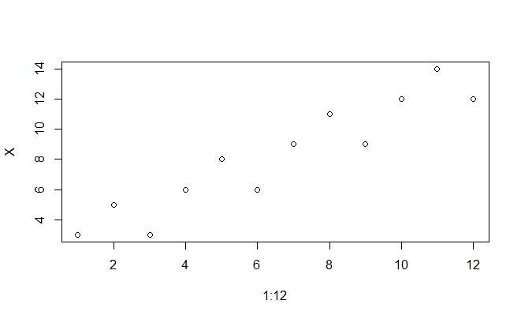
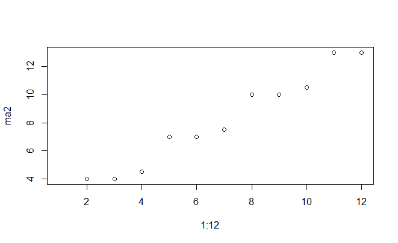
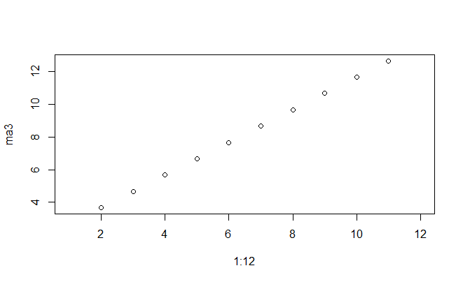

# filter.ma 
###[(link to the .R file)](https://github.com/weitingwlin/r-primers/blob/master/R_files/filter.ma.R)
### Description
The smoothing function for time series data of counts of events recorded at small time interval.

A general equation of moving average calculator can be described as **Eqn.1**. 

(**_xt_** is the original data; **_Sm_** is the smoothed data; **_ar_** is the weight.)

#### Eqn.1
 

(equation edited with [Codecogs](https://www.codecogs.com/latex/eqneditor.php))
### Usage
#####filter.ma(datain)

#####filter.ma(datain, range = c(-1, 0), weights = matrix(1, 1, length(range)))

### Argument
* **datain**: the input data. Vector, or column, row of data.
* **range**: list of **_r_** in as in Eqn.1. 
	+ Default: `c(-1, 0)`. Average of current data and the data at one step before.  
* **weights**: the relative weight correspond to the **range**. Will be standardized (so all weights sum to 1) before calculation.
    + Default: `matrix(1, 1, length(range))`. All points weight equally.
 
### Example
##### make mock data
The original data contains a trend and periodic component.

	X <- 1:12 + c(2, 3, 0)
    plot(1:12, X)
 
##### Add a two point moving average filter:

	ma2<-filter.ma(X)
	plot(1:12, ma2)
 

#####Add a three point filter:

    ma3<-filter.ma(X, -1:1) 
	plot(1:12, ma2)
 

## References
 Chatfield, C. (2003). The Analysis of Time Series: An Introduction, Sixth Edition. Taylor & Francis  
  
